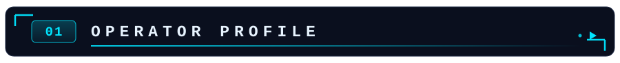
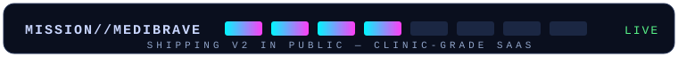
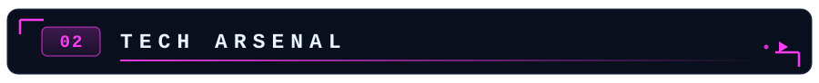
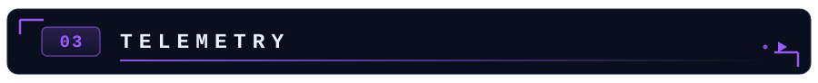
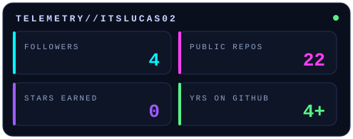
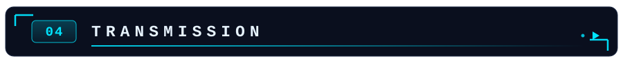
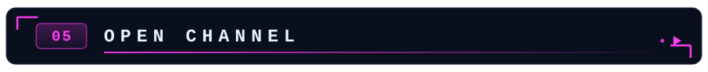

<div align="center">
  
</div>

<br />

<div align="center">
  <a href="https://aizzul.com"></a>
  <a href="mailto:aizzulluqman454@gmail.com"></a>
  <a href="https://github.com/itsLucas02"></a>
</div>

<br />



<div align="center">

```console
aizzul@github:~$ whoami
```

</div>

🥽 **XR Developer** building at the intersection of immersive tech & real-world software
🏥 Shipping **[MediBrave CMS](https://aizzul.com)** — clinic-grade SaaS for healthcare providers in Malaysia
🤖 Deep in **AI automation** — RAG pipelines, vector databases, agent workflows
🎯 Mission: level up into a **high-level SaaS builder**, one deploy at a time

<div align="center">
  <br />
  
</div>

<br />



<div align="center">

**▸ FRONTEND**

<a href="https://react.dev"></a>
<a href="https://vitejs.dev"></a>
<a href="https://tailwindcss.com"></a>
<a href="https://ui.shadcn.com"></a>

**▸ BACKEND**

<a href="https://nodejs.org"></a>
<a href="https://expressjs.com"></a>
<a href="https://supabase.com"></a>

**▸ AI & AUTOMATION**

<a href="https://openai.com"></a>
<a href="https://n8n.io"></a>
<a href="https://pinecone.io"></a>

**▸ TOOLS**

<a href="https://docker.com"></a>
<a href="https://github.com/features/actions"></a>
<a href="https://openai.com"></a>

</div>

<br />



<div align="center">

<table>
  <tr>
    <td width="50%">
      <!-- Live tile regenerated daily by .github/workflows/update-telemetry.yml — self-owned, immune to third-party outages -->
      
    </td>
    <td width="50%">
      <!-- NOTE: streak theme is rotated daily by .github/workflows/rotate-streak-theme.yml — do not remove -->
      
    </td>
  </tr>
</table>


<!--
  Third-party stat cards pulled after upstream outages (stats: HTTP 503, trophies: HTTP 402).
  The public instances are rate-limited beyond our control — restore below if they ever recover,
  or self-host github-readme-stats on your own Vercel account for guaranteed uptime:


-->


</div>

<br />



<div align="center">

```console
aizzul@github:~$ cat /etc/mindset
```

</div>

> ### “Your first workout will be bad.
> Your first podcast will be bad.
> Your first speech will be bad.
> Your first video will be bad.
> Your first ANYTHING will be bad.
>
> **But you can’t make your 100th without making your first.**
> So put your ego aside… and start.”

<br />



<div align="center">

```console
aizzul@github:~$ ./open_channel --protocol handshake
```

`STATUS:` **accepting signals** 📡 — building something in XR, SaaS or AI automation?

<br />

<a href="https://aizzul.com"></a>
<a href="mailto:aizzulluqman454@gmail.com"></a>

<br /><br />

<sub>⟨/⟩ END OF TRANSMISSION — rebuilt from scratch with hand-crafted SVG, zero copied layouts</sub>

## note

</div>
