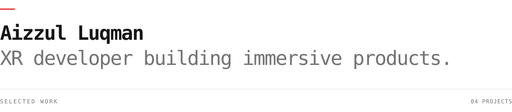
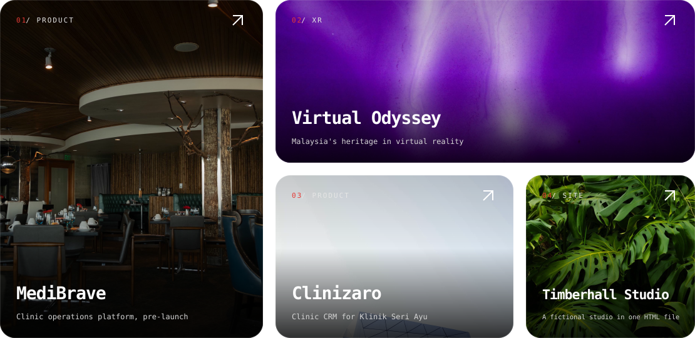
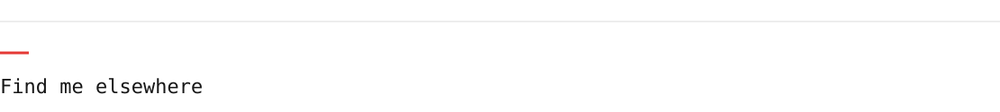
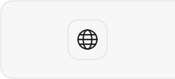
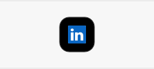
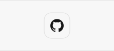
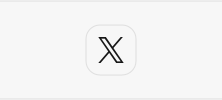
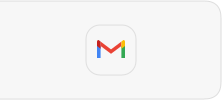

<picture>
  <source media="(prefers-color-scheme: dark)" srcset="assets/intro-dark.svg">
  
</picture>

<picture>
  <source media="(prefers-color-scheme: dark)" srcset="assets/social-header-dark.svg">
  
</picture>

<a href="https://aizzul.com" title="Website"><picture><source media="(prefers-color-scheme: dark)" srcset="assets/social-panel-website-dark.svg"></picture></a><a href="https://www.linkedin.com/in/aizzul-luqman/" title="LinkedIn"><picture><source media="(prefers-color-scheme: dark)" srcset="assets/social-panel-linkedin-dark.svg"></picture></a><a href="https://github.com/itsLucas02" title="GitHub"><picture><source media="(prefers-color-scheme: dark)" srcset="assets/social-panel-github-dark.svg"></picture></a><a href="https://x.com/ItsLuqs" title="X"><picture><source media="(prefers-color-scheme: dark)" srcset="assets/social-panel-x-dark.svg"></picture></a><a href="mailto:aizzulluqman454@gmail.com" title="Email"><picture><source media="(prefers-color-scheme: dark)" srcset="assets/social-panel-email-dark.svg"></picture></a>
